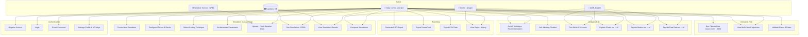

# Use Case Diagram — Full System

```mermaid
graph TD
    subgraph Actors
        U[👤 Data Center Operator]
        A[👤 Admin / Analyst]
        S[🤖 AI/ML Engine]
        W[🌐 Weather Service - NREL]
        DB[(🗄️ Supabase DB)]
    end

    subgraph Authentication
        UC1[Register Account]
        UC2[Login]
        UC3[Reset Password]
        UC4[Manage Profile & API Keys]
    end

    subgraph Simulation Management
        UC5[Create New Simulation]
        UC6[Configure IT Load & Racks]
        UC7[Select Cooling Technique]
        UC8[Set Advanced Parameters]
        UC9[Upload / Fetch Weather Data]
        UC10[Run Simulation - 8760h]
        UC11[View Simulation Results]
        UC12[Compare Simulations]
    end

    subgraph Analytics & AI
        UC13[Get AI Technique Recommendation]
        UC14[Ask Advisory Chatbot]
        UC15[Run What-If Scenario]
        UC16[Explain Charts via LLM]
        UC17[Explain Metrics via LLM]
        UC18[Explain Raw Data via LLM]
    end

    subgraph Reporting
        UC19[Generate PDF Report]
        UC20[Export PowerPoint]
        UC21[Export CSV Data]
        UC22[View Report History]
    end

    subgraph Climate & Risk
        UC23[Run Climate Risk Assessment - 2050]
        UC24[View Multi-Year Projections]
        UC25[Validate Phase 4 Gates]
    end

    U --> UC1
    U --> UC2
    U --> UC3
    U --> UC4
    U --> UC5
    U --> UC6
    U --> UC7
    U --> UC8
    U --> UC9
    U --> UC10
    U --> UC11
    U --> UC12
    U --> UC13
    U --> UC14
    U --> UC15
    U --> UC16
    U --> UC17
    U --> UC18
    U --> UC19
    U --> UC20
    U --> UC21
    U --> UC22
    U --> UC23
    U --> UC24
    U --> UC25

    A --> UC12
    A --> UC22
    A --> UC24

    S --> UC13
    S --> UC15
    S --> UC16
    S --> UC17
    S --> UC18

    W --> UC9
    DB --> UC10
    DB --> UC11
```
