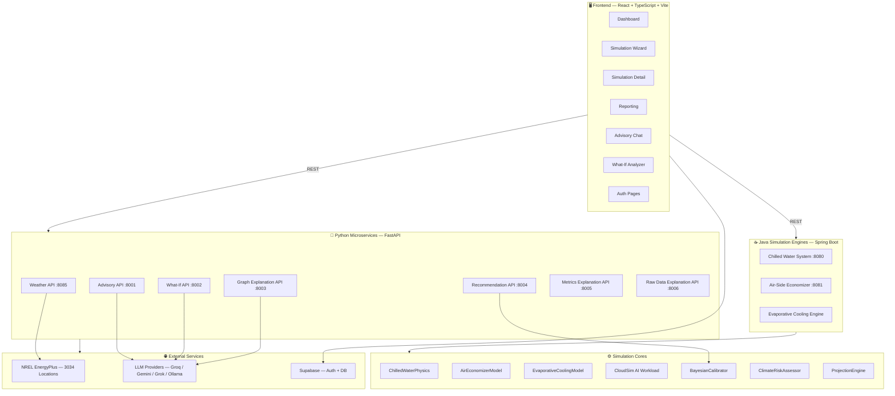

# System Architecture Diagram

```mermaid
graph TB
    subgraph Frontend["🖥️ Frontend — React + TypeScript + Vite"]
        FE1[Dashboard]
        FE2[Simulation Wizard]
        FE3[Simulation Detail]
        FE4[Reporting]
        FE5[Advisory Chat]
        FE6[What-If Analyzer]
        FE7[Auth Pages]
    end

    subgraph PythonAPIs["🐍 Python Microservices — FastAPI"]
        P1[Weather API :8085]
        P2[Advisory API :8001]
        P3[What-If API :8002]
        P4[Graph Explanation API :8003]
        P5[Recommendation API :8004]
        P6[Metrics Explanation API :8005]
        P7[Raw Data Explanation API :8006]
    end

    subgraph JavaBackends["☕ Java Simulation Engines — Spring Boot"]
        J1[Chilled Water System :8080]
        J2[Air-Side Economizer :8081]
        J3[Evaporative Cooling Engine]
    end

    subgraph SimEngines["⚙️ Simulation Cores"]
        SE1[ChilledWaterPhysics]
        SE2[AirEconomizerModel]
        SE3[EvaporativeCoolingModel]
        SE4[CloudSim AI Workload]
        SE5[BayesianCalibrator]
        SE6[ClimateRiskAssessor]
        SE7[ProjectionEngine]
    end

    subgraph ExternalServices["🌐 External Services"]
        EX1[NREL EnergyPlus — 3034 Locations]
        EX2[LLM Providers — Groq / Gemini / Grok / Ollama]
        EX3[Supabase — Auth + DB]
    end

    Frontend -->|REST| PythonAPIs
    Frontend -->|REST| JavaBackends
    PythonAPIs --> ExternalServices
    JavaBackends --> SimEngines
    P1 --> EX1
    P2 --> EX2
    P3 --> EX2
    P4 --> EX2
    P5 --> SE5
    Frontend --> EX3
```
