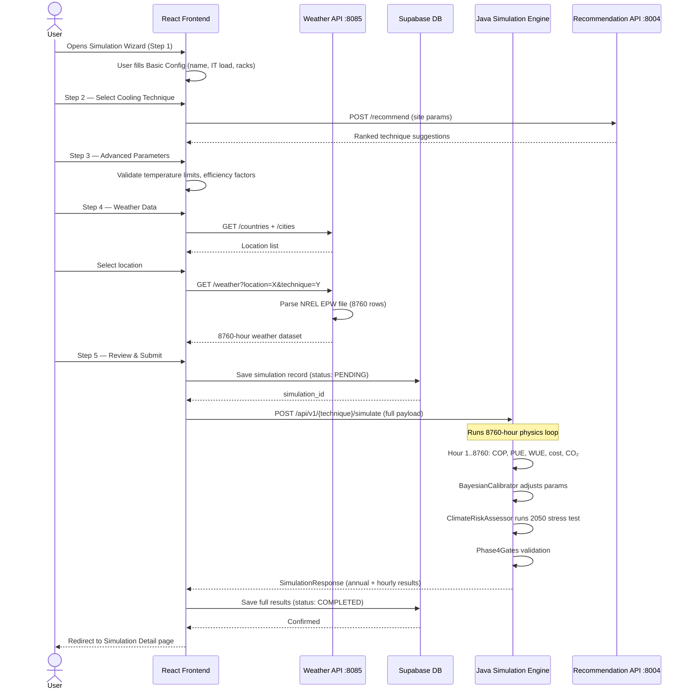

# Sequence Diagram — Simulation Creation & Execution Flow

```mermaid
sequenceDiagram
    actor User
    participant UI as React Frontend
    participant WA as Weather API :8085
    participant SB as Supabase DB
    participant JE as Java Simulation Engine
    participant RA as Recommendation API :8004

    User->>UI: Opens Simulation Wizard (Step 1)
    UI->>UI: User fills Basic Config (name, IT load, racks)

    User->>UI: Step 2 — Select Cooling Technique
    UI->>RA: POST /recommend (site params)
    RA-->>UI: Ranked technique suggestions

    User->>UI: Step 3 — Advanced Parameters
    UI->>UI: Validate temperature limits, efficiency factors

    User->>UI: Step 4 — Weather Data
    UI->>WA: GET /countries + /cities
    WA-->>UI: Location list
    User->>UI: Select location
    UI->>WA: GET /weather?location=X&technique=Y
    WA->>WA: Parse NREL EPW file (8760 rows)
    WA-->>UI: 8760-hour weather dataset

    User->>UI: Step 5 — Review & Submit
    UI->>SB: Save simulation record (status: PENDING)
    SB-->>UI: simulation_id

    UI->>JE: POST /api/v1/{technique}/simulate (full payload)
    Note over JE: Runs 8760-hour physics loop
    JE->>JE: Hour 1..8760: COP, PUE, WUE, cost, CO₂
    JE->>JE: BayesianCalibrator adjusts params
    JE->>JE: ClimateRiskAssessor runs 2050 stress test
    JE->>JE: Phase4Gates validation
    JE-->>UI: SimulationResponse (annual + hourly results)

    UI->>SB: Save full results (status: COMPLETED)
    SB-->>UI: Confirmed
    UI-->>User: Redirect to Simulation Detail page
```
