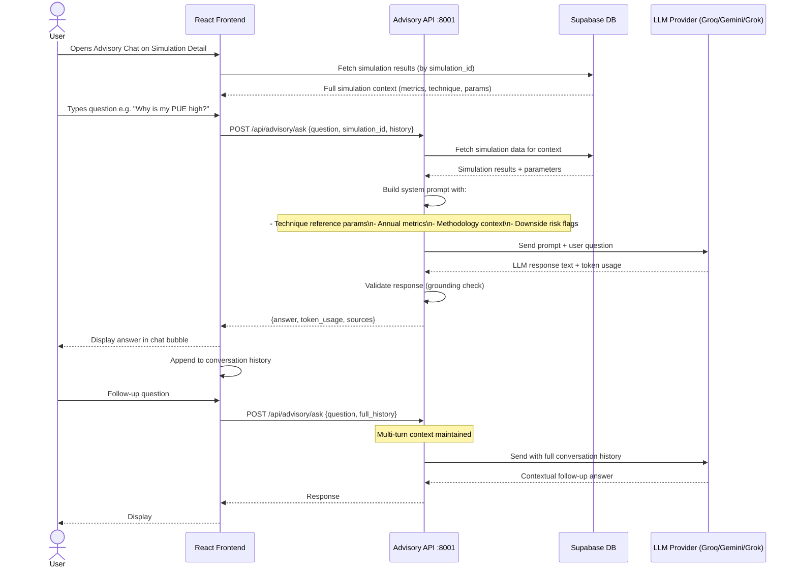

# Sequence Diagram — AI Advisory Chat Flow

```mermaid
sequenceDiagram
    actor User
    participant UI as React Frontend
    participant AA as Advisory API :8001
    participant SB as Supabase DB
    participant LLM as LLM Provider (Groq/Gemini/Grok)

    User->>UI: Opens Advisory Chat on Simulation Detail
    UI->>SB: Fetch simulation results (by simulation_id)
    SB-->>UI: Full simulation context (metrics, technique, params)

    User->>UI: Types question e.g. "Why is my PUE high?"
    UI->>AA: POST /api/advisory/ask {question, simulation_id, history}

    AA->>SB: Fetch simulation data for context
    SB-->>AA: Simulation results + parameters

    AA->>AA: Build system prompt with:
    Note over AA: - Technique reference params\n- Annual metrics\n- Methodology context\n- Downside risk flags

    AA->>LLM: Send prompt + user question
    LLM-->>AA: LLM response text + token usage

    AA->>AA: Validate response (grounding check)
    AA-->>UI: {answer, token_usage, sources}

    UI-->>User: Display answer in chat bubble
    UI->>UI: Append to conversation history

    User->>UI: Follow-up question
    UI->>AA: POST /api/advisory/ask {question, full_history}
    Note over AA: Multi-turn context maintained
    AA->>LLM: Send with full conversation history
    LLM-->>AA: Contextual follow-up answer
    AA-->>UI: Response
    UI-->>User: Display
```
