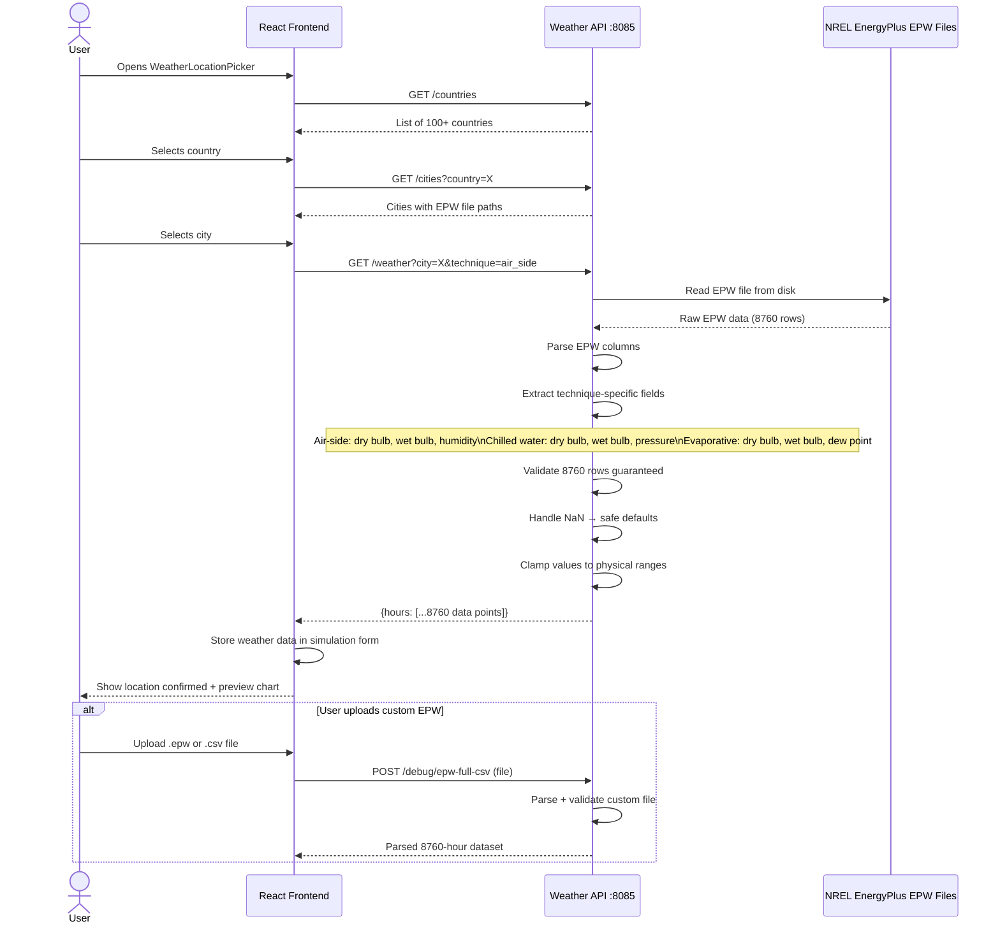

# Sequence Diagram — Weather Data Fetch Flow

```mermaid
sequenceDiagram
    actor User
    participant UI as React Frontend
    participant WA as Weather API :8085
    participant NREL as NREL EnergyPlus EPW Files

    User->>UI: Opens WeatherLocationPicker
    UI->>WA: GET /countries
    WA-->>UI: List of 100+ countries

    User->>UI: Selects country
    UI->>WA: GET /cities?country=X
    WA-->>UI: Cities with EPW file paths

    User->>UI: Selects city
    UI->>WA: GET /weather?city=X&technique=air_side
    WA->>NREL: Read EPW file from disk
    NREL-->>WA: Raw EPW data (8760 rows)

    WA->>WA: Parse EPW columns
    WA->>WA: Extract technique-specific fields
    Note over WA: Air-side: dry bulb, wet bulb, humidity\nChilled water: dry bulb, wet bulb, pressure\nEvaporative: dry bulb, wet bulb, dew point

    WA->>WA: Validate 8760 rows guaranteed
    WA->>WA: Handle NaN → safe defaults
    WA->>WA: Clamp values to physical ranges
    WA-->>UI: {hours: [...8760 data points]}

    UI->>UI: Store weather data in simulation form
    UI-->>User: Show location confirmed + preview chart

    alt User uploads custom EPW
        User->>UI: Upload .epw or .csv file
        UI->>WA: POST /debug/epw-full-csv (file)
        WA->>WA: Parse + validate custom file
        WA-->>UI: Parsed 8760-hour dataset
    end
```
