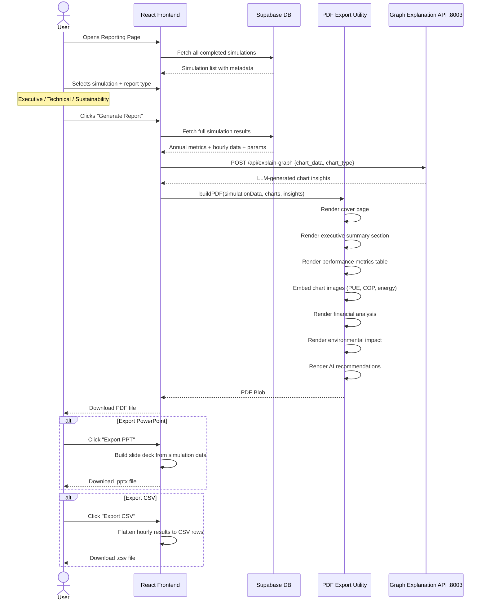

# Sequence Diagram — Report Generation Flow

```mermaid
sequenceDiagram
    actor User
    participant UI as React Frontend
    participant SB as Supabase DB
    participant PE as PDF Export Utility
    participant GE as Graph Explanation API :8003

    User->>UI: Opens Reporting Page
    UI->>SB: Fetch all completed simulations
    SB-->>UI: Simulation list with metadata

    User->>UI: Selects simulation + report type
    Note over User: Executive / Technical / Sustainability

    User->>UI: Clicks "Generate Report"
    UI->>SB: Fetch full simulation results
    SB-->>UI: Annual metrics + hourly data + params

    UI->>GE: POST /api/explain-graph {chart_data, chart_type}
    GE-->>UI: LLM-generated chart insights

    UI->>PE: buildPDF(simulationData, charts, insights)
    PE->>PE: Render cover page
    PE->>PE: Render executive summary section
    PE->>PE: Render performance metrics table
    PE->>PE: Embed chart images (PUE, COP, energy)
    PE->>PE: Render financial analysis
    PE->>PE: Render environmental impact
    PE->>PE: Render AI recommendations
    PE-->>UI: PDF Blob

    UI-->>User: Download PDF file

    alt Export PowerPoint
        User->>UI: Click "Export PPT"
        UI->>UI: Build slide deck from simulation data
        UI-->>User: Download .pptx file
    end

    alt Export CSV
        User->>UI: Click "Export CSV"
        UI->>UI: Flatten hourly results to CSV rows
        UI-->>User: Download .csv file
    end
```
