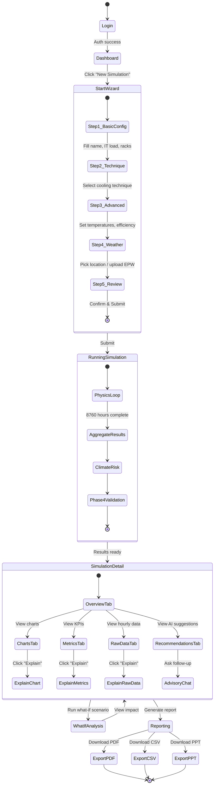

# Activity Diagram — User: Create & Analyze a Simulation

```mermaid
stateDiagram-v2
    [*] --> Login
    Login --> Dashboard : Auth success

    Dashboard --> StartWizard : Click "New Simulation"

    state StartWizard {
        [*] --> Step1_BasicConfig
        Step1_BasicConfig --> Step2_Technique : Fill name, IT load, racks
        Step2_Technique --> Step3_Advanced : Select cooling technique
        Step3_Advanced --> Step4_Weather : Set temperatures, efficiency
        Step4_Weather --> Step5_Review : Pick location / upload EPW
        Step5_Review --> [*] : Confirm & Submit
    }

    StartWizard --> RunningSimulation : Submit

    state RunningSimulation {
        [*] --> PhysicsLoop
        PhysicsLoop --> AggregateResults : 8760 hours complete
        AggregateResults --> ClimateRisk
        ClimateRisk --> Phase4Validation
        Phase4Validation --> [*]
    }

    RunningSimulation --> SimulationDetail : Results ready

    state SimulationDetail {
        [*] --> OverviewTab
        OverviewTab --> ChartsTab : View charts
        OverviewTab --> MetricsTab : View KPIs
        OverviewTab --> RawDataTab : View hourly data
        OverviewTab --> RecommendationsTab : View AI suggestions
        ChartsTab --> ExplainChart : Click "Explain"
        MetricsTab --> ExplainMetrics : Click "Explain"
        RawDataTab --> ExplainRawData : Click "Explain"
        RecommendationsTab --> AdvisoryChat : Ask follow-up
    }

    SimulationDetail --> WhatIfAnalysis : Run what-if scenario
    WhatIfAnalysis --> SimulationDetail : View impact

    SimulationDetail --> Reporting : Generate report
    Reporting --> ExportPDF : Download PDF
    Reporting --> ExportCSV : Download CSV
    Reporting --> ExportPPT : Download PPT

    ExportPDF --> [*]
    ExportCSV --> [*]
    ExportPPT --> [*]
```
