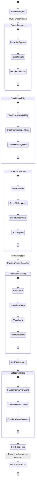

# Activity Diagram — ML Recommendation Engine

```mermaid
stateDiagram-v2
    [*] --> ReceiveRequest
    ReceiveRequest --> ExtractFeatures : POST /recommend

    state ExtractFeatures {
        [*] --> ParseSiteParams
        ParseSiteParams --> ParseClimate
        ParseClimate --> ParseEconomics
        ParseEconomics --> [*]
    }

    ExtractFeatures --> CheckFeasibility

    state CheckFeasibility {
        [*] --> CheckWaterAvailability
        CheckWaterAvailability --> CheckTemperatureRange
        CheckTemperatureRange --> CheckHumidityLimits
        CheckHumidityLimits --> [*]
    }

    CheckFeasibility --> ScoreTechniques

    state ScoreTechniques {
        [*] --> ScoreAirSide
        ScoreAirSide --> ScoreChilledWater
        ScoreChilledWater --> ScoreEvaporative
        ScoreEvaporative --> ScoreHybrid
        ScoreHybrid --> [*]
    }

    ScoreTechniques --> RandomForestClassifier : 300 estimators
    RandomForestClassifier --> MultiFactorScoring

    state MultiFactorScoring {
        [*] --> CostScore
        CostScore --> EmissionsScore
        EmissionsScore --> WaterScore
        WaterScore --> FeasibilityScore
        FeasibilityScore --> [*]
    }

    MultiFactorScoring --> RankTechniques
    RankTechniques --> DetectViolations

    state DetectViolations {
        [*] --> CheckThermalViolations
        CheckThermalViolations --> CheckWaterViolations
        CheckWaterViolations --> CheckCarbonViolations
        CheckCarbonViolations --> [*]
    }

    DetectViolations --> BuildResponse
    BuildResponse --> ReturnRankedList : Ranked techniques + pros/cons
    ReturnRankedList --> [*]
```
