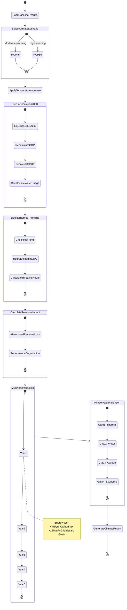

# Activity Diagram — Climate Risk Assessment (2050 Projection)

```mermaid
stateDiagram-v2
    [*] --> LoadBaselineResults
    LoadBaselineResults --> SelectClimateScenario

    state SelectClimateScenario {
        [*] --> RCP45 : Moderate warming
        [*] --> RCP85 : High warming
        RCP45 --> [*]
        RCP85 --> [*]
    }

    SelectClimateScenario --> ApplyTemperatureIncrease
    ApplyTemperatureIncrease --> RerunSimulation2050

    state RerunSimulation2050 {
        [*] --> AdjustWeatherData
        AdjustWeatherData --> RecalculateCOP
        RecalculateCOP --> RecalculatePUE
        RecalculatePUE --> RecalculateWaterUsage
        RecalculateWaterUsage --> [*]
    }

    RerunSimulation2050 --> DetectThermalThrottling

    state DetectThermalThrottling {
        [*] --> CheckInletTemp
        CheckInletTemp --> HoursExceeding27C
        HoursExceeding27C --> CalculateThrottlingHours
        CalculateThrottlingHours --> [*]
    }

    DetectThermalThrottling --> CalculateRevenueImpact

    state CalculateRevenueImpact {
        [*] --> AIWorkloadRevenueLoss
        AIWorkloadRevenueLoss --> PerformanceDegradation
        PerformanceDegradation --> [*]
    }

    CalculateRevenueImpact --> MultiYearProjection

    state MultiYearProjection {
        [*] --> Year1
        Year1 --> Year2
        Year2 --> Year3
        Year3 --> Year4
        Year4 --> Year5
        Year5 --> [*]
        note right of Year1 : Energy cost +3%/yr\nCarbon tax +15%/yr\nGrid decarb -2%/yr
    }

    MultiYearProjection --> Phase4GateValidation

    state Phase4GateValidation {
        [*] --> Gate1_Thermal
        Gate1_Thermal --> Gate2_Water
        Gate2_Water --> Gate3_Carbon
        Gate3_Carbon --> Gate4_Economic
        Gate4_Economic --> [*]
    }

    Phase4GateValidation --> GenerateClimateReport
    GenerateClimateReport --> [*]
```
