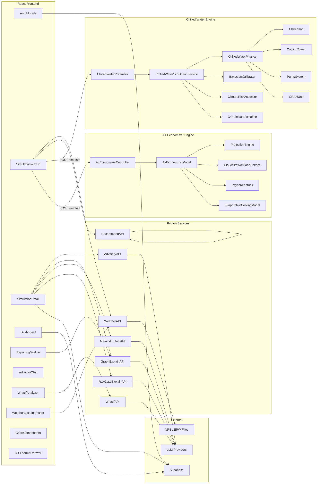

# Component Diagram — Full System Components & Dependencies

```mermaid
graph LR
    subgraph UI["React Frontend"]
        C1[AuthModule]
        C2[SimulationWizard]
        C3[SimulationDetail]
        C4[Dashboard]
        C5[ReportingModule]
        C6[AdvisoryChat]
        C7[WhatIfAnalyzer]
        C8[WeatherLocationPicker]
        C9[ChartComponents]
        C10[3D Thermal Viewer]
    end

    subgraph PyServices["Python Services"]
        P1[WeatherAPI]
        P2[AdvisoryAPI]
        P3[WhatIfAPI]
        P4[GraphExplainAPI]
        P5[RecommendAPI]
        P6[MetricsExplainAPI]
        P7[RawDataExplainAPI]
    end

    subgraph JavaCW["Chilled Water Engine"]
        J1[ChilledWaterController]
        J2[ChilledWaterSimulationService]
        J3[ChilledWaterPhysics]
        J4[ChillerUnit]
        J5[CoolingTower]
        J6[PumpSystem]
        J7[CRAHUnit]
        J8[BayesianCalibrator]
        J9[ClimateRiskAssessor]
        J10[CarbonTaxEscalation]
    end

    subgraph JavaAir["Air Economizer Engine"]
        A1[AirEconomizerController]
        A2[AirEconomizerModel]
        A3[ProjectionEngine]
        A4[CloudSimWorkloadService]
        A5[Psychrometrics]
        A6[EvaporativeCoolingModel]
    end

    subgraph Ext["External"]
        E1[Supabase]
        E2[NREL EPW Files]
        E3[LLM Providers]
    end

    C2 --> P1
    C2 --> P5
    C3 --> P2
    C3 --> P4
    C3 --> P6
    C3 --> P7
    C7 --> P3
    C8 --> P1
    C5 --> P4
    C1 --> E1
    C3 --> E1
    C4 --> E1

    C2 -->|POST simulate| J1
    C2 -->|POST simulate| A1

    J1 --> J2
    J2 --> J3
    J3 --> J4
    J3 --> J5
    J3 --> J6
    J3 --> J7
    J2 --> J8
    J2 --> J9
    J2 --> J10

    A1 --> A2
    A2 --> A3
    A2 --> A4
    A2 --> A5
    A2 --> A6

    P1 --> E2
    P2 --> E3
    P3 --> E3
    P4 --> E3
    P6 --> E3
    P7 --> E3
    P5 --> P5
```
