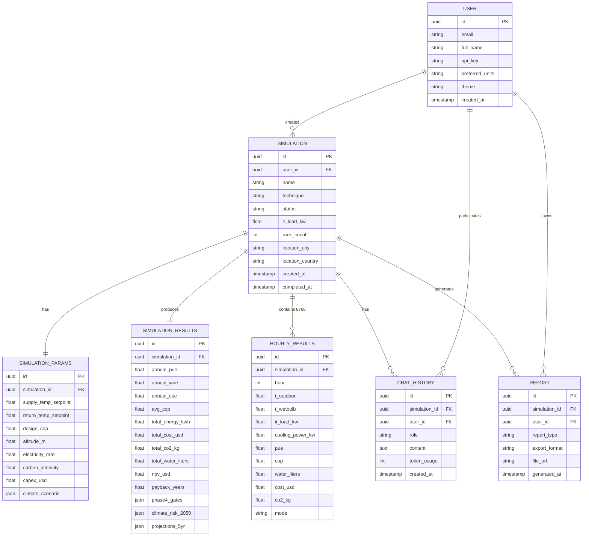

# Entity-Relationship Diagram — Data Model

```mermaid
erDiagram
    USER {
        uuid id PK
        string email
        string full_name
        string api_key
        string preferred_units
        string theme
        timestamp created_at
    }

    SIMULATION {
        uuid id PK
        uuid user_id FK
        string name
        string technique
        string status
        float it_load_kw
        int rack_count
        string location_city
        string location_country
        timestamp created_at
        timestamp completed_at
    }

    SIMULATION_PARAMS {
        uuid id PK
        uuid simulation_id FK
        float supply_temp_setpoint
        float return_temp_setpoint
        float design_cop
        float altitude_m
        float electricity_rate
        float carbon_intensity
        float capex_usd
        json climate_scenario
    }

    SIMULATION_RESULTS {
        uuid id PK
        uuid simulation_id FK
        float annual_pue
        float annual_wue
        float annual_cue
        float avg_cop
        float total_energy_kwh
        float total_cost_usd
        float total_co2_kg
        float total_water_liters
        float npv_usd
        float payback_years
        json phase4_gates
        json climate_risk_2050
        json projections_5yr
    }

    HOURLY_RESULTS {
        uuid id PK
        uuid simulation_id FK
        int hour
        float t_outdoor
        float t_wetbulb
        float it_load_kw
        float cooling_power_kw
        float pue
        float cop
        float water_liters
        float cost_usd
        float co2_kg
        string mode
    }

    CHAT_HISTORY {
        uuid id PK
        uuid simulation_id FK
        uuid user_id FK
        string role
        text content
        int token_usage
        timestamp created_at
    }

    REPORT {
        uuid id PK
        uuid simulation_id FK
        uuid user_id FK
        string report_type
        string export_format
        string file_url
        timestamp generated_at
    }

    USER ||--o{ SIMULATION : "creates"
    SIMULATION ||--|| SIMULATION_PARAMS : "has"
    SIMULATION ||--|| SIMULATION_RESULTS : "produces"
    SIMULATION ||--o{ HOURLY_RESULTS : "contains 8760"
    SIMULATION ||--o{ CHAT_HISTORY : "has"
    SIMULATION ||--o{ REPORT : "generates"
    USER ||--o{ CHAT_HISTORY : "participates"
    USER ||--o{ REPORT : "owns"
```
