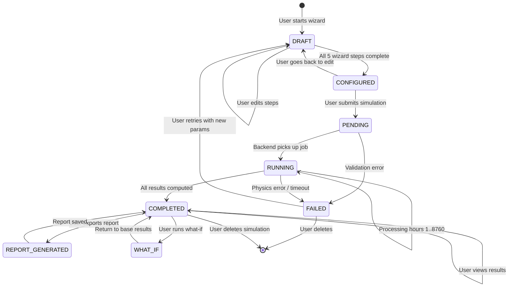

# State Diagram — Simulation Lifecycle

```mermaid
stateDiagram-v2
    [*] --> DRAFT : User starts wizard

    DRAFT --> CONFIGURED : All 5 wizard steps complete
    DRAFT --> DRAFT : User edits steps

    CONFIGURED --> PENDING : User submits simulation
    CONFIGURED --> DRAFT : User goes back to edit

    PENDING --> RUNNING : Backend picks up job
    PENDING --> FAILED : Validation error

    RUNNING --> RUNNING : Processing hours 1..8760
    RUNNING --> COMPLETED : All results computed
    RUNNING --> FAILED : Physics error / timeout

    COMPLETED --> COMPLETED : User views results
    COMPLETED --> REPORT_GENERATED : User exports report
    COMPLETED --> WHAT_IF : User runs what-if

    WHAT_IF --> COMPLETED : Return to base results
    REPORT_GENERATED --> COMPLETED : Report saved

    FAILED --> DRAFT : User retries with new params
    FAILED --> [*] : User deletes

    COMPLETED --> [*] : User deletes simulation
```
