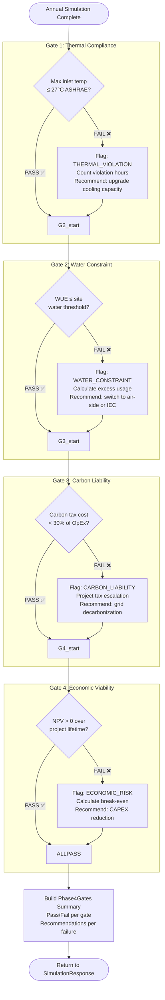

# Flowchart — Phase 4 Gate Validation

```mermaid
flowchart TD
    A([Annual Simulation Complete]) --> G1

    subgraph Gate1["Gate 1: Thermal Compliance"]
        G1{Max inlet temp\n≤ 27°C ASHRAE?}
        G1 -->|PASS ✅| G2_start
        G1 -->|FAIL ❌| G1F[Flag: THERMAL_VIOLATION\nCount violation hours\nRecommend: upgrade cooling capacity]
        G1F --> G2_start
    end

    subgraph Gate2["Gate 2: Water Constraint"]
        G2_start --> G2{WUE ≤ site\nwater threshold?}
        G2 -->|PASS ✅| G3_start
        G2 -->|FAIL ❌| G2F[Flag: WATER_CONSTRAINT\nCalculate excess usage\nRecommend: switch to air-side or IEC]
        G2F --> G3_start
    end

    subgraph Gate3["Gate 3: Carbon Liability"]
        G3_start --> G3{Carbon tax cost\n< 30% of OpEx?}
        G3 -->|PASS ✅| G4_start
        G3 -->|FAIL ❌| G3F[Flag: CARBON_LIABILITY\nProject tax escalation\nRecommend: grid decarbonization]
        G3F --> G4_start
    end

    subgraph Gate4["Gate 4: Economic Viability"]
        G4_start --> G4{NPV > 0 over\nproject lifetime?}
        G4 -->|PASS ✅| ALLPASS
        G4 -->|FAIL ❌| G4F[Flag: ECONOMIC_RISK\nCalculate break-even\nRecommend: CAPEX reduction]
        G4F --> ALLPASS
    end

    ALLPASS --> SUMMARY[Build Phase4Gates Summary\nPass/Fail per gate\nRecommendations per failure]
    SUMMARY --> RETURN([Return to SimulationResponse])
```
