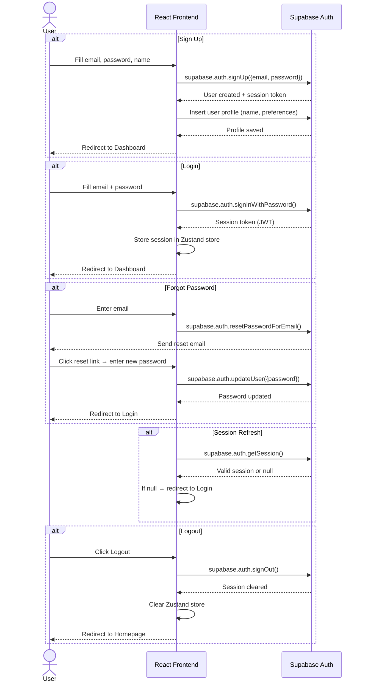

# Sequence Diagram — Authentication Flow

```mermaid
sequenceDiagram
    actor User
    participant UI as React Frontend
    participant SB as Supabase Auth

    alt Sign Up
        User->>UI: Fill email, password, name
        UI->>SB: supabase.auth.signUp({email, password})
        SB-->>UI: User created + session token
        UI->>SB: Insert user profile (name, preferences)
        SB-->>UI: Profile saved
        UI-->>User: Redirect to Dashboard
    end

    alt Login
        User->>UI: Fill email + password
        UI->>SB: supabase.auth.signInWithPassword()
        SB-->>UI: Session token (JWT)
        UI->>UI: Store session in Zustand store
        UI-->>User: Redirect to Dashboard
    end

    alt Forgot Password
        User->>UI: Enter email
        UI->>SB: supabase.auth.resetPasswordForEmail()
        SB-->>User: Send reset email
        User->>UI: Click reset link → enter new password
        UI->>SB: supabase.auth.updateUser({password})
        SB-->>UI: Password updated
        UI-->>User: Redirect to Login
    end

    alt Session Refresh
        UI->>SB: supabase.auth.getSession()
        SB-->>UI: Valid session or null
        UI->>UI: If null → redirect to Login
    end

    alt Logout
        User->>UI: Click Logout
        UI->>SB: supabase.auth.signOut()
        SB-->>UI: Session cleared
        UI->>UI: Clear Zustand store
        UI-->>User: Redirect to Homepage
    end
```
