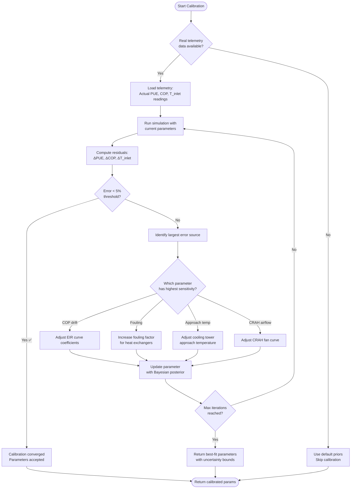

# Flowchart — Bayesian Calibration Engine

```mermaid
flowchart TD
    A([Start Calibration]) --> B{Real telemetry\ndata available?}
    B -->|No| Z[Use default priors\nSkip calibration]
    B -->|Yes| C[Load telemetry:\nActual PUE, COP, T_inlet readings]

    C --> D[Run simulation with\ncurrent parameters]
    D --> E[Compute residuals:\nΔPUE, ΔCOP, ΔT_inlet]
    E --> F{Error < 5%\nthreshold?}

    F -->|Yes ✅| G[Calibration converged\nParameters accepted]
    F -->|No| H[Identify largest error source]

    H --> I{Which parameter\nhas highest sensitivity?}
    I -->|COP drift| J[Adjust EIR curve coefficients]
    I -->|Fouling| K[Increase fouling factor\nfor heat exchangers]
    I -->|Approach temp| L[Adjust cooling tower\napproach temperature]
    I -->|CRAH airflow| M[Adjust CRAH fan curve]

    J --> N[Update parameter\nwith Bayesian posterior]
    K --> N
    L --> N
    M --> N

    N --> O{Max iterations\nreached?}
    O -->|No| D
    O -->|Yes| P[Return best-fit parameters\nwith uncertainty bounds]

    G --> Q([Return calibrated params])
    P --> Q
    Z --> Q
```
