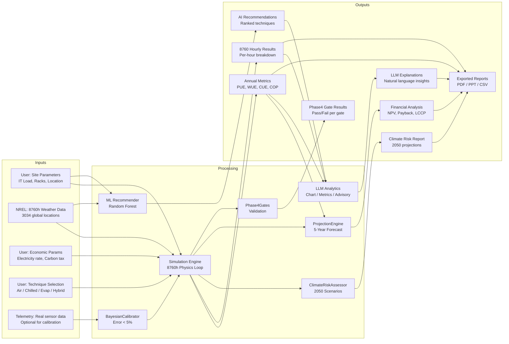

# Data Flow Diagram — End-to-End System

```mermaid
flowchart LR
    subgraph Inputs
        I1[User: Site Parameters\nIT Load, Racks, Location]
        I2[NREL: 8760h Weather Data\n3034 global locations]
        I3[User: Economic Params\nElectricity rate, Carbon tax]
        I4[User: Technique Selection\nAir / Chilled / Evap / Hybrid]
        I5[Telemetry: Real sensor data\nOptional for calibration]
    end

    subgraph Processing
        P1[Simulation Engine\n8760h Physics Loop]
        P2[BayesianCalibrator\nError < 5%]
        P3[ClimateRiskAssessor\n2050 Scenarios]
        P4[ProjectionEngine\n5-Year Forecast]
        P5[Phase4Gates\nValidation]
        P6[ML Recommender\nRandom Forest]
        P7[LLM Analytics\nChart / Metrics / Advisory]
    end

    subgraph Outputs
        O1[Annual Metrics\nPUE, WUE, CUE, COP]
        O2[8760 Hourly Results\nPer-hour breakdown]
        O3[Financial Analysis\nNPV, Payback, LCCP]
        O4[Climate Risk Report\n2050 projections]
        O5[Phase4 Gate Results\nPass/Fail per gate]
        O6[AI Recommendations\nRanked techniques]
        O7[LLM Explanations\nNatural language insights]
        O8[Exported Reports\nPDF / PPT / CSV]
    end

    I1 --> P1
    I2 --> P1
    I3 --> P1
    I4 --> P1
    I5 --> P2
    P2 --> P1
    P1 --> O1
    P1 --> O2
    P1 --> P3
    P1 --> P4
    P1 --> P5
    O1 --> P4
    O2 --> P7
    P3 --> O4
    P4 --> O3
    P5 --> O5
    I1 --> P6
    I2 --> P6
    P6 --> O6
    O1 --> P7
    O6 --> P7
    P7 --> O7
    O1 --> O8
    O2 --> O8
    O3 --> O8
    O4 --> O8
    O7 --> O8
```
