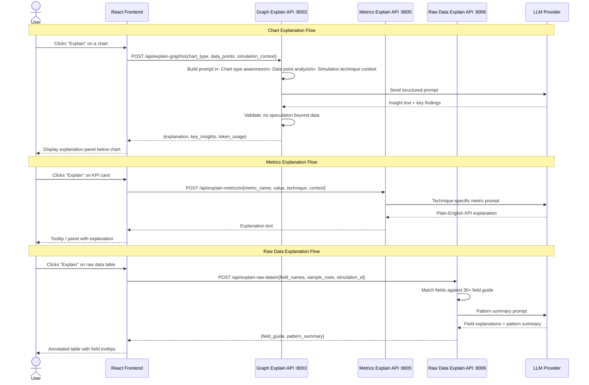

# Sequence Diagram — LLM Graph / Metrics / Raw Data Explanation Flow

```mermaid
sequenceDiagram
    actor User
    participant UI as React Frontend
    participant GE as Graph Explain API :8003
    participant ME as Metrics Explain API :8005
    participant RD as Raw Data Explain API :8006
    participant LLM as LLM Provider

    Note over User,LLM: Chart Explanation Flow
    User->>UI: Clicks "Explain" on a chart
    UI->>GE: POST /api/explain-graph\n{chart_type, data_points, simulation_context}
    GE->>GE: Build prompt:\n- Chart type awareness\n- Data point analysis\n- Simulation technique context
    GE->>LLM: Send structured prompt
    LLM-->>GE: Insight text + key findings
    GE->>GE: Validate: no speculation beyond data
    GE-->>UI: {explanation, key_insights, token_usage}
    UI-->>User: Display explanation panel below chart

    Note over User,LLM: Metrics Explanation Flow
    User->>UI: Clicks "Explain" on KPI card
    UI->>ME: POST /api/explain-metrics\n{metric_name, value, technique, context}
    ME->>LLM: Technique-specific metric prompt
    LLM-->>ME: Plain-English KPI explanation
    ME-->>UI: Explanation text
    UI-->>User: Tooltip / panel with explanation

    Note over User,LLM: Raw Data Explanation Flow
    User->>UI: Clicks "Explain" on raw data table
    UI->>RD: POST /api/explain-raw-data\n{field_names, sample_rows, simulation_id}
    RD->>RD: Match fields against 30+ field guide
    RD->>LLM: Pattern summary prompt
    LLM-->>RD: Field explanations + pattern summary
    RD-->>UI: {field_guide, pattern_summary}
    UI-->>User: Annotated table with field tooltips
```
