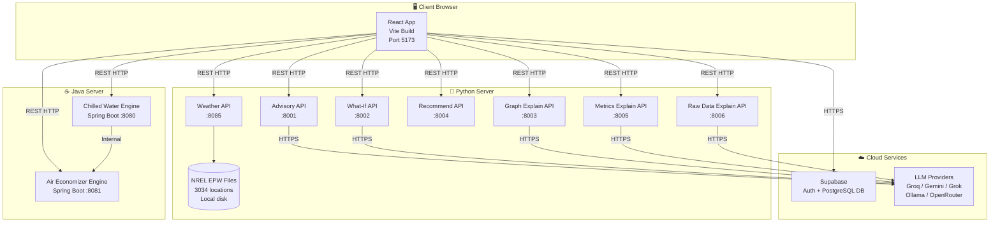

# Deployment Diagram

```mermaid
graph TB
    subgraph Client["🖥️ Client Browser"]
        FE[React App\nVite Build\nPort 5173]
    end

    subgraph PythonServer["🐍 Python Server"]
        PA[Advisory API\n:8001]
        PW[What-If API\n:8002]
        PG[Graph Explain API\n:8003]
        PR[Recommend API\n:8004]
        PM[Metrics Explain API\n:8005]
        PRD[Raw Data Explain API\n:8006]
        PWA[Weather API\n:8085]
        PWA --> EPW[(NREL EPW Files\n3034 locations\nLocal disk)]
    end

    subgraph JavaServer["☕ Java Server"]
        JCW[Chilled Water Engine\nSpring Boot :8080]
        JAE[Air Economizer Engine\nSpring Boot :8081]
    end

    subgraph Cloud["☁️ Cloud Services"]
        SB[Supabase\nAuth + PostgreSQL DB]
        LLM[LLM Providers\nGroq / Gemini / Grok\nOllama / OpenRouter]
    end

    FE -->|REST HTTP| PA
    FE -->|REST HTTP| PW
    FE -->|REST HTTP| PG
    FE -->|REST HTTP| PR
    FE -->|REST HTTP| PM
    FE -->|REST HTTP| PRD
    FE -->|REST HTTP| PWA
    FE -->|REST HTTP| JCW
    FE -->|REST HTTP| JAE
    FE -->|HTTPS| SB

    PA -->|HTTPS| LLM
    PW -->|HTTPS| LLM
    PG -->|HTTPS| LLM
    PM -->|HTTPS| LLM
    PRD -->|HTTPS| LLM

    JCW -->|Internal| JAE
```
